# 🏥 AI Consultation Summary SaaS


An AI-powered healthcare consultation application that helps doctors generate patient visit summaries, next steps, and draft emails automatically using OpenAI's GPT models.

## 📋 Table of Contents

- [Overview](#overview)
- [Architecture](#architecture)
- [Tech Stack](#tech-stack)
- [Features](#features)
- [Getting Started](#getting-started)
- [Deployment](#deployment)
- [Environment Variables](#environment-variables)

## 🎯 Overview

This application allows healthcare professionals to:
1. Enter patient consultation notes
2. Generate AI-powered summaries
3. Get recommended next steps
4. Create draft emails for patients

The app uses **streaming responses** for real-time AI output and **Clerk authentication** with subscription billing for access control.

## 🏗️ Architecture

### High-Level Architecture

```mermaid
flowchart TB
    subgraph Client["🖥️ Client (Browser)"]
        subgraph Frontend["Next.js Frontend"]
            Landing["Landing Page<br/>(index.tsx)"]
            Product["Product Page<br/>(product.tsx)"]
            ClerkUI["Clerk Components<br/>(SignIn, UserButton,<br/>PricingTable, Protect)"]
        end
    end

    subgraph Backend["⚙️ Backend (FastAPI)"]
        subgraph Server["api/server.py"]
            Auth["Clerk Auth<br/>Middleware<br/>(JWT Validation)"]
            API["POST /api/<br/>consultation"]
            Static["Static File<br/>Server<br/>(Next.js Export)"]
        end
    end

    subgraph External["🌐 External Services"]
        OpenAI["OpenAI<br/>(GPT-4o-mini)<br/>• Streaming API<br/>• Chat Completions"]
        Clerk["Clerk<br/>(Authentication<br/>& Billing)<br/>• JWKS Validation"]
    end

    Client -->|"HTTPS + JWT Token"| Backend
    Auth --> API
    API -->|"API Request"| OpenAI
    Auth -->|"Validate JWT"| Clerk

    style Client fill:#e1f5fe
    style Backend fill:#fff3e0
    style External fill:#f3e5f5
```



### Request Flow

```mermaid
sequenceDiagram
    autonumber
    participant User as 👨‍⚕️ User (Doctor)
    participant Clerk as 🔐 Clerk Auth
    participant Frontend as 💻 Frontend (Next.js)
    participant FastAPI as ⚙️ FastAPI Backend
    participant OpenAI as 🤖 OpenAI API

    User->>Clerk: Sign In
    Clerk-->>User: JWT Token
    
    User->>Frontend: Submit Consultation Notes
    Frontend->>FastAPI: POST /api/consultation + JWT Token
    
    FastAPI->>Clerk: Validate JWT via JWKS
    Clerk-->>FastAPI: Token Valid ✓
    
    FastAPI->>OpenAI: Stream Request
    
    loop Streaming Response
        OpenAI-->>FastAPI: GPT Stream Chunks
        FastAPI-->>Frontend: SSE Stream
        Frontend-->>User: Real-time Summary Display
    end
```



### Deployment Architecture (AWS)

```mermaid
flowchart TB
    subgraph AWS["☁️ AWS Cloud"]
        subgraph AppRunner["AWS App Runner"]
            subgraph Container["🐳 Docker Container"]
                FastAPI["FastAPI Server<br/>(Port 8000)<br/>• /api/*<br/>• /health"]
                StaticFiles["Static Files<br/>(Next.js)<br/>/static/*<br/>• index.html<br/>• product.html"]
            end
        end
        
        subgraph ECR["AWS ECR"]
            Image["📦 Container Image<br/>consultation-app:latest"]
        end
    end

    subgraph EnvVars["🔑 Environment Variables"]
        OpenAIKey["OPENAI_API_KEY"]
        ClerkJWKS["CLERK_JWKS_URL"]
        ClerkSecret["CLERK_SECRET_KEY"]
    end

    ECR -->|"Deploy"| AppRunner
    EnvVars -->|"Inject"| Container

    style AWS fill:#ff9800,color:#fff
    style Container fill:#2196f3,color:#fff
    style ECR fill:#4caf50,color:#fff
```



### Alternative: Vercel Deployment

```mermaid
flowchart TB
    subgraph Vercel["▲ Vercel Platform"]
        subgraph Edge["Edge Network (CDN)"]
            CDN["Static Assets + ISR Pages"]
        end
        
        subgraph NextJS["Next.js Frontend"]
            Pages["Pages Router<br/>• SSR/SSG Pages<br/>• Clerk Integration"]
        end
        
        subgraph Serverless["Python Serverless Functions"]
            APIFunc["api/index.py → /api<br/>• FastAPI + OpenAI<br/>• Clerk JWT Validation"]
        end
    end

    Edge --> NextJS
    NextJS --> Serverless

    style Vercel fill:#000,color:#fff
    style Edge fill:#0070f3,color:#fff
    style Serverless fill:#3b82f6,color:#fff
```



### Component Interaction


## 🛠️ Tech Stack

| Layer | Technology |
|-------|------------|
| **Frontend** | Next.js 16, React, TypeScript, Tailwind CSS |
| **Backend** | FastAPI, Python 3.12, Uvicorn |
| **AI** | OpenAI GPT-4o-mini (streaming) |
| **Authentication** | Clerk (JWT, JWKS, Billing) |
| **Containerization** | Docker, Podman |
| **Deployment** | AWS App Runner, Vercel |
| **CI/CD** | AWS ECR, GitHub |

## ✨ Features

- 🔐 **Secure Authentication** - Clerk-based JWT authentication
- 💳 **Subscription Billing** - Clerk PricingTable integration
- 🤖 **AI-Powered Summaries** - GPT-4o-mini generates structured outputs
- 📡 **Real-time Streaming** - Server-Sent Events (SSE) for live updates
- 📱 **Responsive Design** - Tailwind CSS with dark mode support
- 🐳 **Containerized** - Docker/Podman for consistent deployments
- ☁️ **Multi-cloud** - Deploy to AWS App Runner or Vercel

## 🚀 Getting Started

### Prerequisites

- Node.js 22+
- Python 3.12+
- Podman or Docker
- AWS CLI (for AWS deployment)

### Local Development

1. **Clone the repository:**
   ```bash
   git clone https://github.com/KedarnadhSharma/agenticaisaas.git
   cd agenticaisaas
   ```

2. **Install dependencies:**
   ```bash
   npm install
   pip install -r requirements.txt
   ```

3. **Set up environment variables:**
   ```bash
   cp .env.example .env
   # Edit .env with your actual values
   ```

4. **Run the frontend:**
   ```bash
   npm run dev
   ```

5. **Run the backend (separate terminal):**
   ```bash
   uvicorn api.server:app --reload --port 8000
   ```

## 📦 Deployment

### Deploy to AWS App Runner

1. **Build the Docker image:**
   ```bash
   podman build \
     --platform linux/amd64 \
     --build-arg NEXT_PUBLIC_CLERK_PUBLISHABLE_KEY="$NEXT_PUBLIC_CLERK_PUBLISHABLE_KEY" \
     -t consultation-app .
   ```

2. **Push to ECR:**
   ```bash
   aws ecr get-login-password --region us-east-1 | \
     podman login --username AWS --password-stdin $AWS_ACCOUNT_ID.dkr.ecr.us-east-1.amazonaws.com
   
   podman tag consultation-app:latest $AWS_ACCOUNT_ID.dkr.ecr.us-east-1.amazonaws.com/consultation-app:latest
   podman push $AWS_ACCOUNT_ID.dkr.ecr.us-east-1.amazonaws.com/consultation-app:latest
   ```

3. **Create App Runner service** with environment variables configured.

### Deploy to Vercel

```bash
vercel --prod
```

## 🔐 Environment Variables

| Variable | Description | Required |
|----------|-------------|----------|
| `OPENAI_API_KEY` | OpenAI API key for GPT access | ✅ |
| `CLERK_JWKS_URL` | Clerk JWKS endpoint for JWT validation | ✅ |
| `CLERK_SECRET_KEY` | Clerk secret key | ✅ |
| `NEXT_PUBLIC_CLERK_PUBLISHABLE_KEY` | Clerk public key (frontend) | ✅ |

## 📄 License

MIT License - see [LICENSE](LICENSE) for details.

---

Built with ❤️ using AI-powered development
